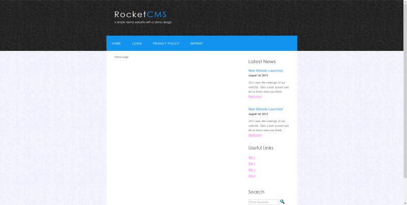

# JuKuCMS

Open Source CMS should be the fastest CMS world wide (WIP).\
 

## Name suggestions

  - **provisional name**: JuKuCMS
  - Falcon CMS (falcons are the fastest animals in the world)
  - RocketCMS (as fast as a rocket - the fastest vehicle on the earth)
  - WarpCMS (suggested by @PascalReintjens)
  - HyperspeedCMS (suggested by @PascalReintjens)

## Main Goals

I am one of the earlier developers of [ContentLion](http://contentlion.org) and now i want to build a new - very fast - CMS (Content Management System).\
My favorite CMS is wordpress, but it has a really big problem: Its very slow.\
I think Wordpress is the best, but also the slowest CMS (also with Cache plugins), because it depends on the software & plugin architecture.\
So i try to make it better! Build a fast CMS with all required features by default, but also very extenable.\
**Main goal**: Reach a performance that CMS can **generate pages in <= 200ms**.

  - fastest CMS in then world
  - scalable
  - supports Memcache
  - based on newest technologies (PHP7 and so on)
  - SEO / search engine friendly by default
  - WYSIWYG Editor (What You See Is What You Get, like Word)
  - support for Blog & ticket (support) systems
  - self repair (if database is broken, this CMS should be able to repair the database itself without any manuall interactions)
  - extendable
  - mobile friendly
  - get high Google page speed score
  - plugin marketplace (only checked plugins!) with speed index (how much they reduce speed of cms)
  
## Requirements

  - PHP 7.0.8+
  - MySQL 5.7+
  - Mod_Rewrite Support
  
## Icon

https://www.iconfinder.com/icons/298861/rocket_icon#size=256, MIT License

## Official Wiki & Support

  - [Wiki](https://juku.github.io/JuKuCMS/)
  - [Mail](mailto:info[at]jukusoft.com)
  
Penetration Tester:

  - https://pentest-tools.com/website-vulnerability-scanning/web-server-scanner?run

## Caching

Currently, following caches are supported:

  - file cache
  - memcache
  - memcached
  - [Hazelcast](http://hazelcast.org)
  
## Architecture

  - Styles (/styles)
  - Plugins (/plugins)
  - Core
      * Kernel (system/packages)
      * Micro-Kernel (system/core/classes, system/core/driver, system/core/exception)
      
## Roadmap

  -   **Core finished** - 06.04.2018 ([Issues](https://github.com/JuKu/JuKuCMS/issues?utf8=%E2%9C%93&q=is%3Aissue+milestone%3ACore+))
  -  **Alpha 0.1.0 finished** - 21.08.2018 ([Issues](https://github.com/JuKu/JuKuCMS/issues?utf8=%E2%9C%93&q=is%3Aissue+milestone%3A%22Alpha+0.1.0%22+))
  -  **Alpha 0.2.0** (WIP) ([Issues](https://github.com/JuKu/JuKuCMS/issues?utf8=%E2%9C%93&q=is%3Aissue+milestone%3A%22Alpha+0.2.0%22+))

**Legend**:

  -  `overdue`
  -  `finished`
  -  `Work In Progress (WIP)`

## First Screenshots

Some early screenshots from core, **main page**:\
\
\
\
**Admin Area**:\

## Presentation

[Slides](http://slides.com/juku/rocketcms/fullscreen)

Badge Links:\
https://poser.pugx.org/

## CONTRIBUTORS / Maintainers

  - Justin Künzel [@JuKu](http://github.com/JuKu) - [jukusoft.com](http://jukusoft.com)
  - Pascal Reinjens [@PascalReintjens](https://github.com/PascalReintjens)

## License

**Styles, Plugins & Packages** can have their own licenses (see LICENSE file in directory)!\
All other code is licensed under **Apache 2.0** license.

