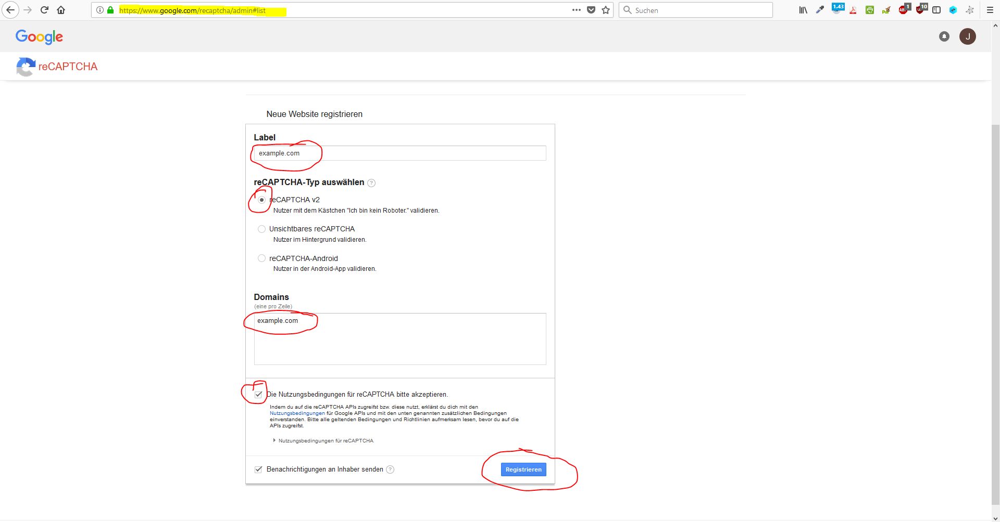
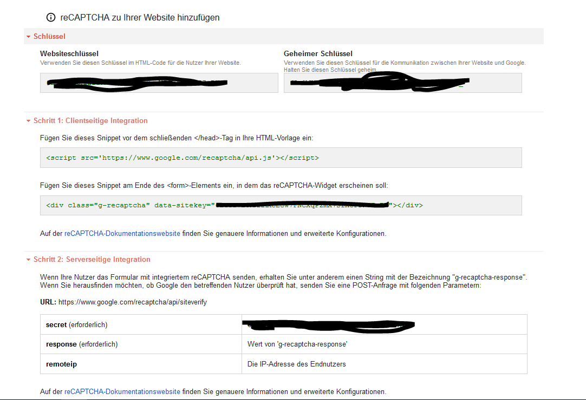

# Captcha

This CMS supports captchas from forms, which are enabled by default.\
(Setting: "captcha_enabled")

## Google™ reCAPTCHA

By default **[reCaptcha](https://developers.google.com/recaptcha/)** is uded, provided by [Google](https://www.google.com/recaptcha/admin)™.\
Before you can use reCAPTCHA, you need a (free) api key from google here:\
[https://www.google.com/recaptcha/admin](https://www.google.com/recaptcha/admin)\
\
So, add a new api key:\
\
\
After that you get **2 keys**:\
\
\
**NOTE THIS KEYS**! Next, if you have this keys, you have to set this keys into your settings.\
\
(For developers: settings "recaptcha_website_key" and "recaptcha_secret_key")