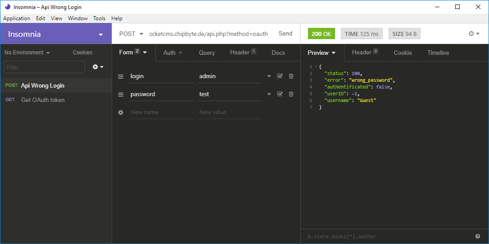

# OAuth

This CMS supports **OAuth**, so users can login per api.

## Get current login state

Call **/api.php?method=oauth** and you will get a result like this:
```json
{
"status": 200,
"authentificated": false,
"userID": -1,
"username": "Guest"
}
```

So you can see, user isn't logged in yet. But also you havent appended an **access token**, so user cannot be logged in.\
With access token **/api.php?method=oauth&amp;access_token=YOUR_ACCESS_TOKEN**:
```json
{
"status": 200,
"authentificated": false,
"userID": -1,
"username": "Guest"
}
```

This result means, user isn't authentificated, because access token is invalide. So you have to renew your login.

## Login

To login you have to send a request to **/api.php?method=oauth** with **POST-data**:

  - login (username of user)
  - password (password of user)
  
For example:



This result means, that password is wrong:
```json
{
	"status": 200,
	"error": "wrong_password",
	"authentificated": false,
	"userID": -1,
	"username": "Guest"
}
```

And if you use your right password you will get a result like this, this means login was successful:
```json
{
	"status": 200,
	"access_token": "GRvojrPxOt0Kmq911YAQSkd6dlpIshtV4io4HBGqFy84nKH1x6bYeDWdfhzqiAG1wMqyBKRbbX9Bgcr9zsajAsGFOcwqRRgCmFKaz9YwbCPZyosl7r7neMxYTgueXrs951Q9zhMyGxiiV2cOP82iWq34S1c8MjwGGFP7jNeUNFyIifCOUPKjSM8sD9HdMU9LAG182f2npmXeflwk1J6Ddqwqd9hOVDc4iMUG8gYLC7SK0Jxuittrq8gGvlq5zvO",
	"authentificated": true,
	"userID": 1,
	"username": "admin"
}
```

The specified **access_token** has to used for futher api requests!
If you call **/api.php?method=oauth&amp;access_token=GRvojrPxOt0Kmq911YAQSkd6dlpIshtV4io4HBGqFy84nKH1x6bYeDWdfhzqiAG1wMqyBKRbbX9Bgcr9zsajAsGFOcwqRRgCmFKaz9YwbCPZyosl7r7neMxYTgueXrs951Q9zhMyGxiiV2cOP82iWq34S1c8MjwGGFP7jNeUNFyIifCOUPKjSM8sD9HdMU9LAG182f2npmXeflwk1J6Ddqwqd9hOVDc4iMUG8gYLC7SK0Jxuittrq8gGvlq5zvO** you will get a result like this, which means, user is logged in and access token is valide:
```json
{
	"status": 200,
	"authentificated": true,
	"userID": 1,
	"username": "admin"
}
```

**NOTE**: You can send access token via GET or POST request, but **password has to send via POST request**!